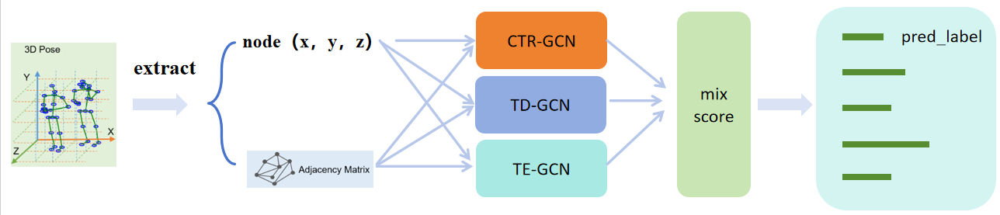

# mix_GCN-1.0
队伍：小飞棍爱cv

# 一、使用数据介绍
**我们使用```joint、bone、joint_bone```模态进行训练和测试，为xyz三通道数据。**<br />
**我们使用比赛官方给的 ``` train_joint.npy ``` 数据集通过比赛官方的仓库方法生成``` train_bone.npy、train_joint_bone.npy ```数据集，测试集B也按照训练集的方法进行生成。**

# 二、模型简介
**我们使用的模型基础为```HDBN模型```，来自论文"[HDBN: A Novel Hybrid Dual-branch Network for Robust Skeleton-based Action Recognition](https://arxiv.org/abs/2404.15719)"，仓库地址为```https://github.com/liujf69/ICMEW2024-Track10/blob/main```**<br />
**我们经过大量实验发现，对于比赛数据集的bone-motion与joint-motion模态，该模型的运行效果不佳，对于最终融合的意义不大。同时运用的二维信息精度也不令人满意，于是我们只使用了三维的```joint、bone、joint_bone```模态进行训练和测试，并对模型整体进行了精简化。模型概述如下：**<br />


# 三、复现过程  
# 数据集导入
**请自备train与testB数据集**<br />
**因为每个人负责不同的模型，数据放置位置没有统一固定，情况不同，复现具体模型时需要按照各模型的yaml文件放置数据集位置**<br />
**如果还需要重新训练，也要下载测试集A按照同样的方法进行放置。**<br />
**以CTR_GCN模型的yaml文件为例进行数据集位置放置：**
```angular2html
#以CTR_GCN为例：
-- CTR_GCN
    -- dataset
        -- feeder_JB.py
        -- feeder_xyz.py
        -- tools.py
        -- save_3d_pose
            -- train_joint.npy
            -- train_bone.npy
            -- train_joint_bone.npy
            -- train_label.npy
            -- test_B_joint.npy
            -- test_B_bone.npy
            -- test_B_joint_bone.npy
            -- test_B_label.npy

#其余数据集放置方法和位置可能不同，请按照具体模型的config文件更改
```
# 运行获取CTR、TD、TE的置信度文件
## 1、运行获取CTR_GCN的j、b、jb模态的置信度文件
### 1.1、CTR_GCN环境配置
首先进入```CTR_GCN```文件夹目录下，根据CTR_GCN.yml配置相关环境，然后在```CTR_GCN```文件夹目录下运行以下命令，安装需要额外导入的一个包：
```
pip install -e torchlight
```
### 1.2、根据```config```目录下的各yaml文件调整和放置data、label文件的位置<br />
**!!!重要：原config文件路径写的什么模态的，就用哪一模态的**<br />
**例如CTR_B.yaml中路径写的joint.npy，就是用joint.npy数据集，而不是bone数据集，因为CTR_B.yaml运用的内置转化将join转化为bone，而不是输入的bone**
### 1.3、运行以下代码获得pkl置信度文件：
```
python main.py --config ./config/ctrgcn_J.yaml --phase test --save-score True --weights ./checkpoints/ctr_j_best.pt --device 0
python main.py --config ./config/ctrgcn_B.yaml --phase test --save-score True --weights ./checkpoints/ctr_b_best.pt --device 0
python main.py --config ./config/ctrgcn_JB.yaml --phase test --save-score True --weights ./checkpoints/ctr_jb_best.pt --device 0
```
**！！！重要**<br />
**如果出现以下报错：**
```
Traceback (most recent call last):
  File "/root/autodl-tmp/复现说明文档/CTR_GCN/main.py", line 27, in <module>
    from torchlight import DictAction
  File "/root/autodl-tmp/复现说明文档/CTR_GCN/torchlight/torchlight/__init__.py", line 1, in <module>
    from .util import IO
  File "/root/autodl-tmp/复现说明文档/CTR_GCN/torchlight/torchlight/util.py", line 16, in <module>
    from torchpack.runner.hooks import PaviLogger
  File "/root/autodl-tmp/miniconda3/envs/mix/lib/python3.10/site-packages/torchpack/__init__.py", line 1, in <module>
    from .config import *
  File "/root/autodl-tmp/miniconda3/envs/mix/lib/python3.10/site-packages/torchpack/config.py", line 4, in <module>
    from collections import Iterable
ImportError: cannot import name 'Iterable' from 'collections' (/root/autodl-tmp/miniconda3/envs/mix/lib/python3.10/collections/__init__.py)
```
**则需要进入具体的环境中去修改文件，我需要修改的位置为```miniconda3/envs/mix/lib/python3.10/site-packages/torchpack```的```config.py```文件，将开头的导入包：```from collections import Iterable```进行修改：**
```angular2html
#原config.py

from collections import Iterable
```
**改为：**
```
#修改后的config.py

from collections.abc import Iterable
```
**然后重新运行命令进行测试**
### 1.4、移动pkl置信度文件
**进入```output```文件夹下，将各文件夹下的置信度文件：```ctr_J.pkl、ctr_B.pkl、ctr_JB.pkl```转移到根文件夹下的```all_mix_pred_data```文件夹下，后面融合时会用到。**                                                                                                                  
## 2、运行获取TD_GCN的j、b、jb模态的置信度文件
### 2.1、首先进入```TD_GCN```文件夹目录下，运行以下命令，安装需要额外导入的一个包：
```
pip install -e torchlight
```
**然后根据```config```目录下的各yaml文件调整和放置data、label文件的位置，调整输出文件夹位置**

### 2.2、运行以下代码获得npy置信度文件：
```
#需要注意的是TD_GCN的输出在work_dir文件夹下，运行一次测试会将上一次的结果覆盖，
#所以需要运行一行移出一次置信度文件`epoch1_test_score.npy`并手动修改文件名

python main_td.py --device 0 --config config/test_joint.yaml
python main_td.py --device 0 --config config/test_bone.yaml
python main_td.py --device 0 --config config/test_joint_bone.yaml
```
### 2.3、移动pkl置信度文件
**进入输出的```work_dir```文件夹下，将各文件夹下的置信度文件```epoch1_test_score.npy```手动修改文件名，转移到根文件夹下的```all_mix_pred_data```文件夹下，后面融合时会用到。**  
## 3、运行获取TE_GCN的j、b、jb模态的置信度文件
### 3.1、根据```config```目录下的各yaml文件调整和放置data、label文件的位置，调整输出文件夹位置
### 3.2、运行以下代码获得npy置信度文件：
```
#因为模型读取问题，只能将pt文件这样命名：
#1-1-1.pt为te_j.pt，2-2-2.pt为te_b.pt，3-3-3.pt为te_jb.pt
#同时需要注意的是TE_GCN的输出在work_dir文件夹下，运行一次测试会将上一次的结果覆盖，
#所以需要运行一行移出一次置信度文件`epoch1_test_score.npy`并手动修改文件名

python main.py --device 0 --config config/test_joint.yaml
python main.py --device 0 --config config/test_bone.yaml
python main.py --device 0 --config config/test_joint_bone.yaml
```
### 3.3、移动npy置信度文件
**进入输出的文件夹下，将各文件夹下的置信度文件转移到根文件夹下的```all_mix_pred_data```文件夹下，后面融合时会用到。**  


#  运行mix_GCN获取融合后的pred.npy文件
**先检查9个pkl置信度文件是否都移动到```mix_data```文件夹下，然后直接运行以下代码即可获得```pred.npy```**
```angular2html
#在文档目录下
python mix_GCN.py
```

# 验证全过程
## 1、训练日志
**我们的训练日志在各个模型文件夹的```log_dir```文件夹内。**
## 2、验证训练过程
**如需要重新验证训练过程，请下载测试集A，按照上述数据集导入方法进行放置，同时更改yaml文件。**<br />
```angular2html
cd CTR_GCN
python main.py --config ./config/ctrgcn_J.yaml --device 0
python main.py --config ./config/ctrgcn_B.yaml --device 0
python main.py --config ./config/ctrgcn_JB.yaml --device 0

cd TD_GCN
python main_td.py --device 0 --config config/TDGCN_joint.yaml
python main_td.py --device 0 --config config/TDGCN_bone.yaml
python main_td.py --device 0 --config config/TDGCN_joint_bone.yaml

cd TE_GCN
python main.py --device 0 --config config/TEGCN_joint.yaml
python main.py --device 0 --config config/TEGCN_bone.yaml
python main.py --device 0 --config config/TEGCN_joint_bone.yaml
```
